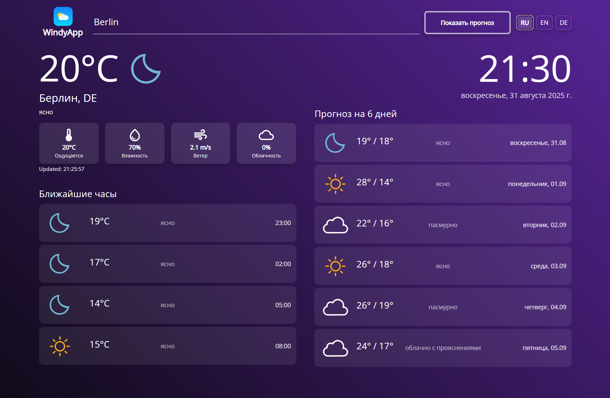

# 🌤️ WindyApp

A modern **React** weather application with **multi-language support** powered by [OpenWeather API](https://openweathermap.org/).

 

---

## ✨ Features

- 🔎 **City search with autocomplete** (OpenWeather Geocoding API)
- 🌡️ **Current weather** (temperature, feels like, humidity, wind, clouds)
- ⏳ **Hourly forecast** (next few hours)
- 📅 **6-day forecast** (min/max temperature, icons, description)
- 🌍 **Language switcher** (EN / RU / DE)
- 🕒 **Localized date & time** formats
- 📱 Fully responsive layout

---

## 🛠️ Tech Stack

- [React 18](https://react.dev/)
- [Vite](https://vitejs.dev/) (build tool)
- [OpenWeather API](https://openweathermap.org/api) (Weather, Forecast, Geocoding)
- [MUI Icons](https://mui.com/material-ui/material-icons/)
- [Framer Motion](https://www.framer.com/motion/) for animations
- React Context + `useI18n` hook for multi-language support

---
---


---

## 🚀 Getting Started

1. **Clone the repository**
   ```bash
   git clone https://github.com/username/windy-app.git
   cd windy-app


2. **Install dependencies**

npm install

3. **Set up your OpenWeather API key in src/utils/constants.jsx: **
export const apiKey = "YOUR_API_KEY_HERE";
export const baseUrl = "https://api.openweathermap.org/data/2.5/";

4. **Start the development server**

npm run dev


5. Open your browser at http://localhost:5173
---